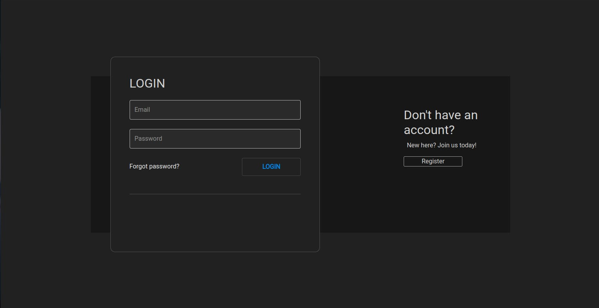
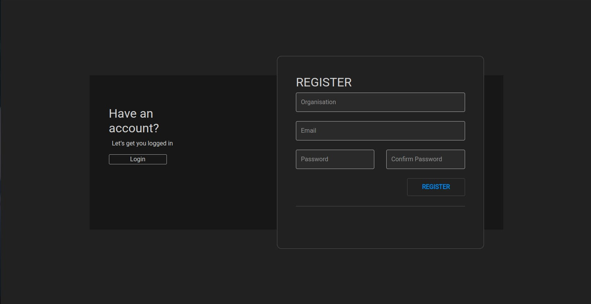
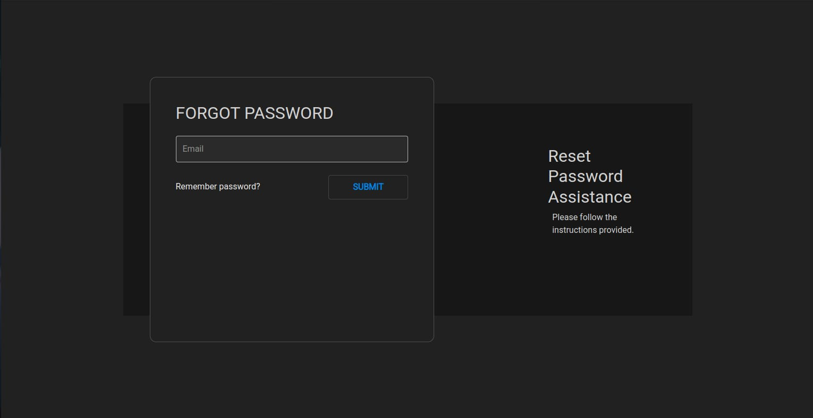
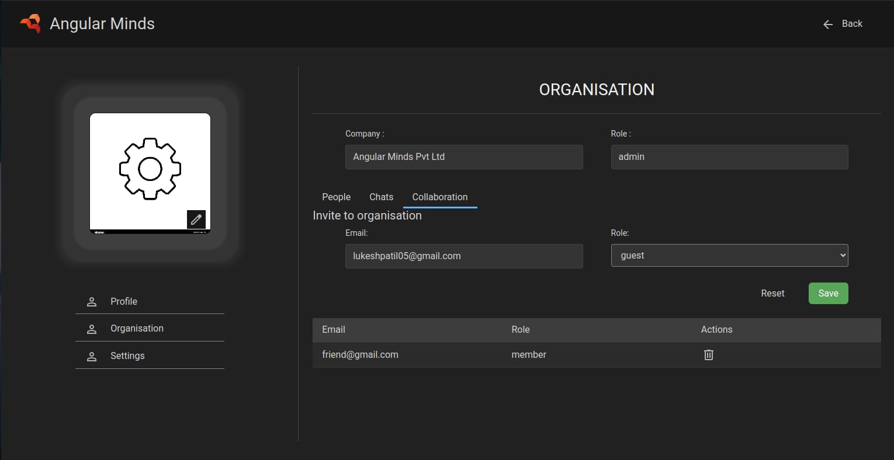
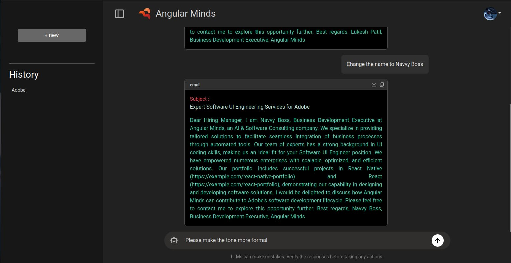
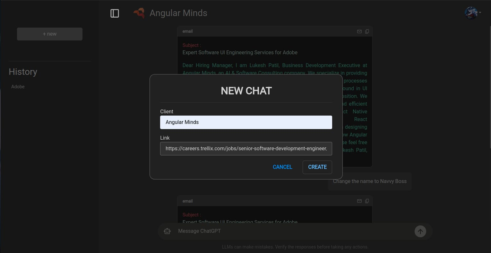

# Overview

**Mail Quill** is an AI-powered cold email automation SaaS platform that scrapes job listings, analyzes descriptions, and generates tailored emails using LangChain and LLMs.

It allows interactive email refinement and supports multi-tenancy, enabling multiple organizations to securely manage users, settings, and data with robust role-based access control.


# Tools and Technologies Used


- **Backend** : Node.js, Express.js, JavaScript, Flask, Langchain, Python
- **Database** : MongoDB, ChromaDB
- **Frontend** : Angular, TypeScript, HTML, CSS
- **External APIS** : Microsoft Azure OpenAI
- **Version Control** : Git & GitHub

### Key NPM Packages Used

<div>
  
  
  
  
  
  
  
  
  
  
</div>

- **express** — Web framework for building APIs
- **dotenv** — Load environment variables from `.env` files
- **body-parser** — Parse incoming request bodies
- **cookie-parser** — Parse and manage cookies in requests
- **mongoose** — MongoDB object modeling for Node.js
- **bcrypt** — Secure password hashing
- **jsonwebtoken** — Generate and verify JSON web tokens
- **nodemailer** — Send emails from your server
- **multer** — Handle file uploads in Node.js
- **nodemon** — Automatically restart the server on file changes
- **langchain** — Framework for developing applications with LLMs
- **flask** — Web framework for building APIs in Python
- **chromadb** — Vector database for embeddings and retrieval


## 🛠️ Usage  

Mail Quill streamlines **automated, AI-driven cold email generation** with an **end-to-end intelligent workflow**. 🧠⚡  

### How It Works 🚀  
1. **🔍 Intelligent Job Scraping** – Extracts **structured job descriptions** from career websites using automated data pipelines.  
2. **🤖 AI-Powered Email Generation** – Utilizes **LangChain** and LLMs to craft highly contextualized, **job-specific** emails.  
3. **📚 Vector-Based Semantic Search & RAG** – Combines **ChromaDB**-powered retrieval, **semantic search**, and **Retrieval Augmented Generation (RAG)** to enrich emails with **relevant** past projects for **hyper-personalization**.  
4. **✏️ Interactive Email Refinement** – Users can **iteratively modify** AI-generated drafts with a real-time **feedback loop** via the chat interface.  
5. **📤 Seamless Email Dispatch & Tracking** – Send finalized emails with automated logging, status tracking, and engagement insights.  

This workflow ensures **efficient, personalized, and high-conversion cold outreach**, making job applications more effective. 💼🔥  


## ✨ Features  

Mail Quill combines **🚀 AI-powered automation**, **📈 scalability**, and **🔒 secure multi-tenancy** to streamline cold email generation.  

### Key Capabilities ✨  
-  **🤖 AI-Generated Cold Emails** – Uses **🧠 LangChain** and **🤯 LLMs** to craft **📩 job-specific** emails based on scraped job descriptions.  
-  **📊 Vector-Based Email Personalization** – Leverages **🗂️ ChromaDB** to match job descriptions with past projects for **🎯 context-aware** messaging.  
-  **💬 Chat-Based Email Refinement** – Allows users to iteratively **🛠️ fine-tune AI-generated drafts** with real-time feedback.  
-  **🏢 Multi-Tenant SaaS Architecture** – Supports multiple organizations with **🛡️ isolated user roles and data segmentation**.  
-  **🔑 Role-Based Access Control (RBAC)** – Implements **⚙️ granular permission management** for secure access control.  
-  **🔐 Secure API Communication** – Uses **🛠️ JWT-based authentication** and **🔑 Bearer Token authorization** for all internal and external API calls.  

Mail Quill is designed for **⚡ efficiency, 🚀 scalability, and 🤖 seamless AI-driven automation**, making it a powerful tool for job seekers and recruiters alike. 📩🔥  


## 🏢 Multi-Tenancy 🚀🏢  
Mail Quill is a **scalable, multi-tenant SaaS** platform designed for **seamless expansion** and **robust data isolation**. Each organization operates within a dedicated, secure environment, ensuring strict access control and compliance.  

### Key Features 📌  
- 🔹 **Isolated User Roles & Data** – Each tenant operates in a fully **sandboxed environment**, preventing unauthorized data access or leakage. 🏰🚧  
- 🔹 **Granular Role-Based Access Control (RBAC)** – Structured user roles ensure that Admins manage configurations, Members execute tasks, and Guests have restricted access. 👑💼  
- 🔹 **Strict Tenant Separation** – A **multi-layered security framework** enforces logical data partitioning and zero-trust access policies to maintain data integrity. 🔐🚫  
- 🔹 **Effortless Horizontal Scalability** – Designed to scale seamlessly, the system accommodates multiple organizations without performance degradation. ⚡🏎️  
- 🔹 **Secure API-Driven Architecture** – Each tenant is assigned **scoped API keys**, **JWT-based authentication**, and **tenant-aware request handling** to ensure secure interactions. 🔑🔒  
- 🔹 **Dynamic Resource Allocation** – System resources scale automatically based on demand, maintaining optimal performance under varying workloads. 📈🚀  
- 🔹 **Multi-Tenant Data Governance** – Built-in **audit logging, access monitoring, and end-to-end encryption** ensure compliance with security best practices. 📜🔍  

This **scalable, resilient architecture** enables Mail Quill to support multiple organizations efficiently while maintaining **high performance, security, and reliability**.  


## 🔒 Security  

Mail Quill is built with **enterprise-grade security** to ensure data protection, secure access, and compliance with industry standards.  

### Key Security Features 🛡️  
- 🔹 **JWT-Based Authentication** – Secure login/logout flow with **Bearer Token** authentication to prevent unauthorized access. 🔑  
- 🔹 **API Authorization** – Secure API communication using **Bearer Tokens** in Authorization headers to validate and authenticate requests. 📡  
- 🔹 **Audit Logging & Monitoring** – Tracks user activities, providing visibility into access and modifications. 📜🔍  
- 🔹 **Multi-Tenant Data Isolation** – Ensures that each organization’s data remains completely separate and inaccessible to others. 🔍🏢  
- 🔹 **Inter-Service Authentication** – The **Node.js microservice** and **Python microservice** communicate securely using **JWT-based authentication**, ensuring trusted requests between internal services. 🔄🔑  


## 🔑 Role-Based Access Control (RBAC)  

Mail Quill enforces **granular, policy-driven RBAC** to ensure users operate strictly within their assigned permissions. Access control is applied across **authentication layers, API endpoints, and UI components** to maintain system integrity.  

### User Roles & Permissions 👥  
- **👑 Admin** – Full control over **user management, configurations, and organizational policies**.  
- **💼 Member** – Can **create, edit, and send emails**, but cannot modify system settings.  
- **👀 Guest** – Read-only access with **strict visibility limitations**.  

RBAC ensures **secure, structured, and permission-aware access**, preventing unauthorized actions while maintaining operational efficiency. 🔒  


## Installation

### Prerequisites
- Node.js (v16 or higher)  
- Npm  
- Python (3.9 or higher)  
- Mongodb account  
- Chromadb account  
- Angular (v18)  
- Microsoft Azure cloud and OpenAI API access  
- Git  
- Visual studio code (recommended IDE)  
- Postman (API testing)  
- Modern web browser (Chrome or Firefox recommended)


### Steps to Set Up Locally

1. Clone the repository
```bash
> git clone <repository-url>
> cd <repository-folder>
```

2. Configure respective `.env` files in each service folder by referring to the respective `sample.env` files.

3. Install gateway API (Node server) dependencies and run
```bash
> cd ../GATEWAY_API
> npm install
> npm start
```

4. Install core (Python microservice) dependencies and run
```bash
> cd CORE
> pip install -r requirements.txt
> python app.py
```

5. Install frontend (Angular app) dependencies and run
```bash
> cd ../FRONTEND
> npm install
> ng serve
```

6. Access the frontend  
🎉 Congratulations! Your frontend is up and running — open your browser and head over to: [http://localhost:4200](http://localhost:4200)

## 📩 Contact  
For any questions, feedback, or collaboration opportunities, feel free to reach out:  

- 📧 **Email:** [your-email@example.com]  
- 🐙 **GitHub Issues:** [Open an Issue](https://github.com/your-repo/issues)  
- 💼 **LinkedIn:** [View My LinkedIn](https://www.linkedin.com/in/lukesh-patil/)  
- 📄 **Resume:** [View My Resume](https://your-resume-link.com)  

If you find this project interesting or have suggestions, I’d love to connect! 🚀


## 📸 Screenshots  

### 🏞️ Authentication  
<div>
    
    
    
</div> 

### 🌲 User dashboard  
<div>
    
    
</div> 

### 🌅 Chat interface  
<div>
    
    
</div>   

### 🌊 Admin panel  
<div>
    
    
</div> 

📸 **For more pictures, visit the** [`/Preview`](./Preview) **folder!** 🔍✨  